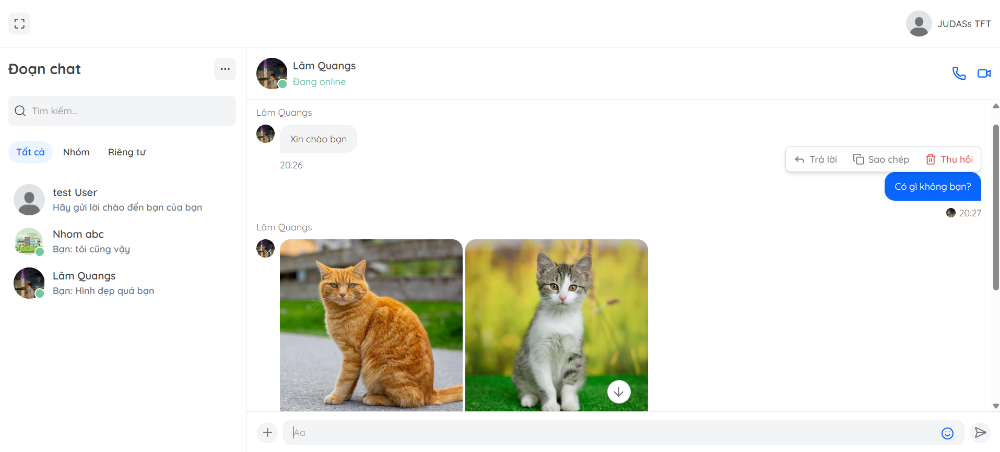

# REAL-TIME WEB CHAT APPLICATION

Ứng dụng chat web thời gian thực với đầy đủ tính năng nhắn tin, quản lý bạn bè và quản lý nhóm trò chuyện.

## Công nghệ sử dụng

| Hạng mục | Công nghệ / Công cụ                                                                                                                                               |
| -------- | ----------------------------------------------------------------------------------------------------------------------------------------------------------------- |
| Frontend | Vite + TypeScript + React 19   TailwindCSS   Redux   Axios + Tanstack query   Zod + React Hook Form   socket.io-client   js-cookie + jwt-decode |
| Backend  | Node.js + Express.js   JWT + bcrypt   Socket.io   Cloudinary + Multer   Nodemailer                                                                    |
| Database | MySQL, MongoDB                                                                                                                                                    |

## Chức năng chính

| Chức năng             | Hành động             | Mô tả                                                                                                  |
| --------------------- | --------------------- | ------------------------------------------------------------------------------------------------------ |
| **Quản lý hội thoại** | Nhắn tin riêng tư     | Cho phép 2 người dùng trao đổi tin nhắn trực tiếp với nhau                                             |
|                       | Nhắn tin nhóm         | Cho phép nhiều người dùng trò chuyện chung trong một nhóm                                              |
|                       | Tạo nhóm              | Tạo nhóm trò chuyện mới với danh sách thành viên ban đầu                                               |
|                       | Cập nhật nhóm         | Đổi tên nhóm, ảnh đại diện nhóm,...                                                                    |
|                       | Thêm/xóa thành viên   | Thành viên trong nhóm có chức vụ là Owner/Admin mới có thể thêm hoặc xóa thành viên khỏi nhóm          |
|                       | Phân quyền thành viên | Bổ nhiệm/gỡ quyền Admin, chuyển quyền Owner                                                            |
|                       | Giải tán nhóm         | Owner mới có thể giải tán nhóm trò chuyện                                                              |
| **Quản lý tin nhắn**  | Gửi tệp đính kèm      | Cho phép gửi kèm hình ảnh, tài liệu, hoặc ghi âm/gửi file audio trong tin nhắn                         |
|                       | Trả lời tin nhắn      | Cho phép phản hồi trực tiếp một tin nhắn cụ thể (của bản thân hoặc người khác), giữ ngữ cảnh hội thoại |
|                       | Thu hồi tin nhắn      | Cho phép người dùng thu hồi tin nhắn đã gửi của chính bản thân họ                                      |
| **Quản lý bạn bè**    | Gửi lời mời kết bạn   | Cho phép người dùng gửi yêu cầu kết bạn đến người dùng khác                                            |
|                       | Đồng ý kết bạn        | Cho phép người dùng chấp nhận lời mời kết bạn đã nhận                                                  |
|                       | Từ chối kết bạn       | Cho phép người dùng từ chối lời mời kết bạn đã nhận                                                    |
|                       | Xóa kết bạn           | Cho phép người dùng gỡ bỏ mối quan hệ bạn bè đã thiết lập trước đó với người khác                      |

## Chức vụ trong nhóm trò chuyện

| Hành động                | Owner | Admin | Member |
| ------------------------ | :---: | :---: | :----: |
| Cập nhật thông tin nhóm  |  ✅   |  ✅   |   ❌   |
| Thêm thành viên vào nhóm |  ✅   |  ✅   |   ❌   |
| Xóa thành viên khỏi nhóm |  ✅   |  ✅   |   ❌   |
| Bổ nhiệm Admin           |  ✅   |  ❌   |   ❌   |
| Gỡ quyền Admin           |  ✅   |  ❌   |   ❌   |
| Chuyển quyền Owner       |  ✅   |  ❌   |   ❌   |
| Giải tán nhóm            |  ✅   |  ❌   |   ❌   |
